============================
dwm es un extremadamente rápido, ligero y dinámico gestor de ventanas para X.

Instalación
------------

En orden a construir dwm necesita los archivos de cabecera de `Xlib`.

Edite `config.mk` para localizar tu configuración local (dwm es instalado en `usr/local` por defecto).

La instalación se hace primero compilando el código:

    make

Y después, con los privilegios adecuados si procede, instalándolo en la ruta configurada:

    sudo make install

Para limpiar de archivos compilados, se ejecuta:

    make clean

Para desinstalar el código del sistema:

    sudo make uninstall

Configuración
-------------
dwm se configura mediante el archivo `config.h` y (re)compilando el código.

Para el correcto funcionamiento del sistema, en conjunto con otras piezas de software, inicio junto a *dwm* otras instrucciones en el archivo *.xinitrc*, siendo el contenido de éste:

```
slstatus &
xbindkeys &
unclutter -idle 3 &
xrdb ~/.Xresources &
feh --bg-scale .background.png &
dunst &
xautolock -time 20 -locker slock &
urxvtd -q &
exec dwm > ~/.dwm.log
```

Parches usados
-------------

Parches estéticos:
* [actualfullscreen](https://dwm.suckless.org/patches/actualfullscreen/) Alterna la pantalla completa para una ventana, en lugar de alternar la barra de estado y el diseño *monocle*.
* [titlecolor](https://dwm.suckless.org/patches/titlecolor/) Añade un nuevo esquema de color utilizado por el título de la ventana en la barra, de modo que sus colores (primer plano y fondo) se pueden cambiar de forma independiente.
* [noborderfloating](https://dwm.suckless.org/patches/noborder/) Elimina el borde cuando sólo haya una ventana visible.

Parches funcionales:
* [movestack](https://dwm.suckless.org/patches/movestack/) Permite mover clientes en la pila e intercambiarlos con el maestro.
* [pertag](https://dwm.suckless.org/patches/pertag/) Mantiene *layout*, *mwfact*, *barpos* y *nmaster* por etiqueta (*tag*).


Cómo usar dwm
-------------
Basado en el artículo [Dave's Visual Guide to dwm](https://ratfactor.com/dwm).

La tecla principal, de ahora en adelante `X`, es `Mod4`. Cabe destacar que, por defecto en el sistema de suckless es `Mod1` (`Alt`).

### Layouts

#### Tiled

La ventana creada comienza a pantalla completa. A medida que se agregan ventanas, se abren en el área `master` (zona izquierda); mientras que las más antiguas se empujan al área `stack`(zona derecha, apiladas).

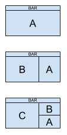

#### Layout keybindings

Mod1-t - tiled layout - re-arranges windows into the dynamically-tiled master/stack configuration (if not already).

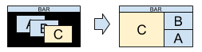

Mod1-m - monocle layout - very handy, single window fullscreen layout - whichever window is focused is pushed to the front and viewed fullscreen. Switch windows by focusing them (see below).

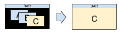

Mod1-f - floating layout - allows windows to overlap and be moved and sized manually.

    Note: nothing will appear to change when you switch to floating layout since all windows will still have the same size and position.

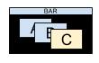

Mod1-space - toggle layouts - this toggles between the most current two layouts.

Mod1-Shift-space - toggle window layout - for the focused window, this toggles between tiled and floating states.


#### Opening and closing windows

By default, there are two ways to open a new window: open an st terminal or run dmenu. Both of these are separate applictions which were constructed specifically to work with dwm. I like them both. Here are the default keybindings for each:

Mod1-Shift-return - open terminal - this specifically opens st, if you want it to open another terminal, you’ll need to customize config.h.

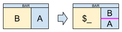


Mod1-p - open dmenu - runs the tiny dynamic menu called dmenu in dwm’s top bar.

    I really like dmenu. It lets you find available applications by typing parts of their names. For example, to launch Firefox on my system, I just press Alt-p, type fire (though just fir is all I need) and hit return.

To close a window, you can either quit it from within the application, or tell dwm to close the window with this keybinding:

Mod1-Shift-c - close focused window

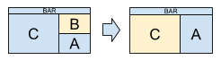

#### Switching window focus

Mod1-j - focus next window - in the tiled layout, this goes in clockwise order.

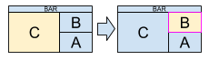

or floating:

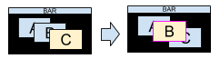

Mod1-k - focus previous window - in the tiled layout, this goes in counter/anti-clockwise order.

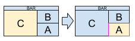

or floating:

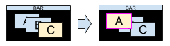

#### Tiled layout shortcuts

Mod1-i - increment master - increase the number of split windows in the master area (will move windows (if any) out of the stacking area as needed).

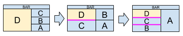

Mod1-d - decrement master - decrease the number of split windows in the master area (will move windows (if any) back to the stacking area as needed).

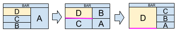

Mod1-l - increase master area size - make the master area physically larger.

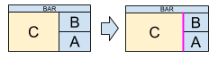

Mod1-h - decrease master area size - make the master area physically smaller.

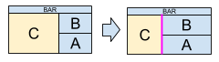

Mod1-Return - zoom - toggle window between the master and stack areas: if the focused window is in the stack, it is moved to the master area and the previous master window is put at the top of the stack; or if the focused window is in the master area, it is put on the stack.

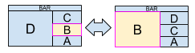

#### Tags

If you’re used to the concept of multiple desktops or virtual desktops, this gives you the same functionality, but with more flexibility. A tag is like a desktop in that it can view a specific set of windows you have open. A tag is unlike a desktop in that a window may belong to more than one tag and you can even view all tags at once. It’s very simple in practice and you only need to learn a few key combinations:

Mod1-Shift-[1..n] - apply tag to window - assigns the tag number to the currently-focused window (like moving a window to a different desktop).

    Example: Alt-Shift-2 assigns the tag '2' to the current window. If you’re currently viewing, say, tag '1', this will make the window disappear until you view tag '2'.

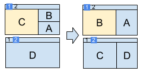

Mod1-[1..n] - view tag - displays all windows with tag number (like viewing a particular desktop).

    Example: Alt-2 displays all windows assigned to tag '2'.

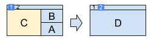

Mod1-Tab - toggle tags - this is like switching between the two most recent desktops.

Mod1-Shift-0 - apply all tags to window - this is like saying "put this window on all desktops."

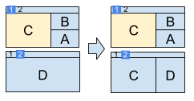

Mod1-Control-Shift-[1..n] - toggle tag n - this adds or removes the tag number for the focused window (like adding or removing the window from a particular desktop).

Mod1-0 - view all windows - regardless of tag (like viewing all desktops at once).

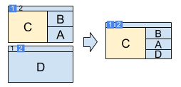

Mod1-Control-[1..n] - banish tags - Add/remove all windows with nth tag to/from the view (only makes sense in the context of the above option of viewing all windows).

#### Quitting dwm

Mod1-Shift-q - quit dwm - You shall return whence you came!

#### Toggle the top bar

Mod1-b - toggle the top bar - It is like a magic appearing/disappearing act! What fun!

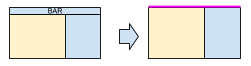

#### Mousing around

I’ll be the first to admit that the mouse has its place. Sometimes you just have to click on a floating window and drag it away to paradise. dwm handles this intuitively (once you know to hold down the Mod1 key).

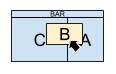

Mod1-Button1 - move window - Hold and drag to move the window. If the window was tiled, it will be floated (the rest of the layout will remain tiled - it’s the best of both worlds!)

Mod1-Button2 - toggle layout - toggles the focused window between the floating and tiled state.

Mod1-Button3 - resize window - Hold and drag to resize the window. As with moving, if the window was tiled, it will be floated.

#### Screens

When I originally made this guide, I didn’t use multiple monitors on my Linux desktop, so I didn’t create graphics for these shortcuts. However, I’ve been using dwm with multiple monitors for years now and it works great!

Mod1-, - focus previous screen

Mod1-. - focus next screen

Mod1-Shift-, - send window to previous screen

Mod1-Shift-. - send window to next screen

(If you just have two monitors, you’ll only need to memorize "previous" OR "next". Having both is only useful for three or more monitors.)
