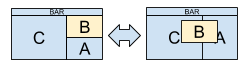

============================
dwm es un extremadamente rápido, ligero y dinámico gestor de ventanas para X.

Instalación
------------

En orden a construir dwm necesita los archivos de cabecera de `Xlib`.

Edite `config.mk` para localizar tu configuración local (dwm es instalado en `usr/local` por defecto).

La instalación se hace primero compilando el código:

    make

Y después, con los privilegios adecuados si procede, instalándolo en la ruta configurada:

    sudo make install

Para limpiar de archivos compilados, se ejecuta:

    make clean

Para desinstalar el código del sistema:

    sudo make uninstall

Configuración
-------------
dwm se configura mediante el archivo `config.h` y (re)compilando el código.

Para el correcto funcionamiento del sistema, en conjunto con otras piezas de software, inicio junto a *dwm* otras instrucciones en el archivo *.xinitrc*, siendo el contenido de éste:

```
slstatus &
xbindkeys &
unclutter -idle 3 &
xrdb ~/.Xresources &
feh --bg-scale .background.png &
dunst &
xautolock -time 20 -locker slock &
urxvtd -q &
exec dwm > ~/.dwm.log
```

Parches usados
-------------

Parches estéticos:
* [actualfullscreen](https://dwm.suckless.org/patches/actualfullscreen/) Alterna la pantalla completa para una ventana, en lugar de alternar la barra de estado y el diseño *monocle*.
* [titlecolor](https://dwm.suckless.org/patches/titlecolor/) Añade un nuevo esquema de color utilizado por el título de la ventana en la barra, de modo que sus colores (primer plano y fondo) se pueden cambiar de forma independiente.
* [noborderfloating](https://dwm.suckless.org/patches/noborder/) Elimina el borde cuando sólo haya una ventana visible.

Parches funcionales:
* [movestack](https://dwm.suckless.org/patches/movestack/) Permite mover clientes en la pila e intercambiarlos con el maestro.
* [pertag](https://dwm.suckless.org/patches/pertag/) Mantiene *layout*, *mwfact*, *barpos* y *nmaster* por etiqueta (*tag*).


Cómo usar dwm
-------------
Basado en el artículo [Dave's Visual Guide to dwm](https://ratfactor.com/dwm).

La tecla principal, de ahora en adelante `X`, es `Mod4`. Cabe destacar que, por defecto en el sistema de suckless es `Mod1` (`Alt`).

### Layouts

#### Tiled

La ventana creada comienza a pantalla completa. A medida que se agregan ventanas, se abren en el área `master` (zona izquierda); mientras que las más antiguas se empujan al área `stack`(zona derecha, apiladas).


#### Layout keybindings

Mod1-t - tiled layout - re-arranges windows into the dynamically-tiled master/stack configuration (if not already).


Mod1-m - monocle layout - very handy, single window fullscreen layout - whichever window is focused is pushed to the front and viewed fullscreen. Switch windows by focusing them (see below).


Mod1-f - floating layout - allows windows to overlap and be moved and sized manually.

    Note: nothing will appear to change when you switch to floating layout since all windows will still have the same size and position.


Mod1-space - toggle layouts - this toggles between the most current two layouts.

Mod1-Shift-space - toggle window layout - for the focused window, this toggles between tiled and floating states.



#### Opening and closing windows

By default, there are two ways to open a new window: open an st terminal or run dmenu. Both of these are separate applictions which were constructed specifically to work with dwm. I like them both. Here are the default keybindings for each:

Mod1-Shift-return - open terminal - this specifically opens st, if you want it to open another terminal, you’ll need to customize config.h.


Mod1-p - open dmenu - runs the tiny dynamic menu called dmenu in dwm’s top bar.

    I really like dmenu. It lets you find available applications by typing parts of their names. For example, to launch Firefox on my system, I just press Alt-p, type fire (though just fir is all I need) and hit return.

To close a window, you can either quit it from within the application, or tell dwm to close the window with this keybinding:

Mod1-Shift-c - close focused window


